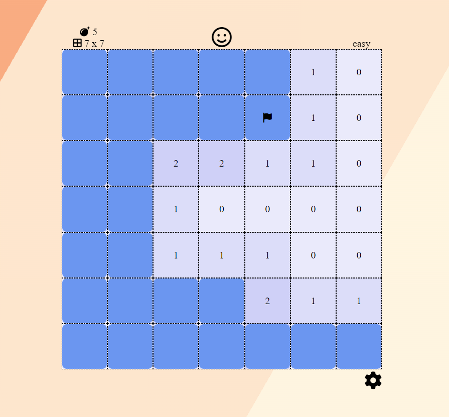

# AngularMinesweeper
My attempt at writing minesweeper using the Angular framework to better learn Angular

The mine-field component holds an array of tile components that initialize based on Input() parameters.
Minefield manages the state of the tiles and utilizes async function calls to create animations and handle multiple gameplay aspects simultaneously, I created a simple boolean indicator system that is akin to a binary semaphore or mutex in behaviour that allows async operations to be stopped without having to manage their promises or track them. The game features three difficulties, and currently only suppourts square game boards / minefields.

This project was generated with [Angular CLI](https://github.com/angular/angular-cli) version 17.0.3.

## controls

left click: reveal tile
left click (long press): flag tile
right click: flag tile 

## Game

## Development server

Run `ng serve` for a dev server. Navigate to `http://localhost:4200/`. The application will automatically reload if you change any of the source files.

## Code scaffolding

Run `ng generate component component-name` to generate a new component. You can also use `ng generate directive|pipe|service|class|guard|interface|enum|module`.

## Build

Run `ng build` to build the project. The build artifacts will be stored in the `dist/` directory.

## Running unit tests

Run `ng test` to execute the unit tests via [Karma](https://karma-runner.github.io).

## Running end-to-end tests

Run `ng e2e` to execute the end-to-end tests via a platform of your choice. To use this command, you need to first add a package that implements end-to-end testing capabilities.

## Further help

To get more help on the Angular CLI use `ng help` or go check out the [Angular CLI Overview and Command Reference](https://angular.io/cli) page.
